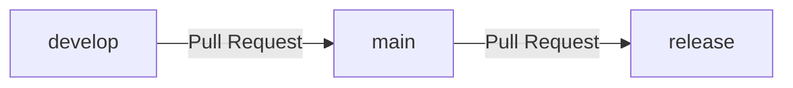

# 開發規範文檔

## 📝 Commit Message 規範

遵循 [Conventional Commits](https://www.conventionalcommits.org/) 規範

### 常用類型

| 類型 | 說明 |
|------|------|
| `feat` | 新功能（feature） |
| `fix` | 修復 bug |
| `docs` | 文檔更新 |
| `style` | 格式調整（不影響程式邏輯） |
| `refactor` | 程式碼重構 |
| `test` | 測試相關 |
| `chore` | 構建過程或輔助工具變動 |

### 範例

- `feat(login): 新增用戶登錄功能`
- `fix(api): 修復用戶資料查詢報錯`
- `docs(readme): 補充安裝說明`
- `refactor: 優化數據庫查詢邏輯`

---

## 🏷️ 版本號規範

遵循 [Semantic Versioning](https://semver.org) 標準（SemVer）

### 版本格式

```
v主版本號.次版本號.修訂號[-後綴]
```

**範例：** `v1.2.3-beta.1`

### 版本號說明

- **MAJOR（主版本）**: 重大變更、不兼容的 API 變化
- **MINOR（次版本）**: 新增功能，向下兼容
- **PATCH（修訂號）**: Bug 修復或小幅改動，向下兼容

### 版本後綴

- `-alpha`: 開發早期版本，功能不完整，僅供內部測試
- `-beta`: 功能基本完成，進入測試階段
- `-rc`: 發佈候選版本，已知問題基本修完

### 版本號管理

> 📌 **重要說明**: 版本號不需要開發者手動管理，統一由 GitHub Actions workflow 或專人負責管理

---

## 🌲 分支管理

### 分支說明

| 分支 | 環境 | 版本範例 | 用途 |
|------|------|----------|------|
| `main` | 預發佈（staging） | `v1.0.0-rc.1` | 主分支，用於預發佈 |
| `release` | 生產（production） | `v1.0.0` | 正式發版分支 |
| `develop` | 開發 | `v1.0.0-beta.1` | 開發分支 |
| `feature/*` | - | - | 功能開發分支 |
| `bugfix/*` | - | - | Bug 修復分支 |

---

## 🔄 工作流程

### 開發流程

1. **創建分支**: 從 `develop` 新建功能分支
   ```bash
   git checkout develop
   git pull origin develop
   git checkout -b feature/新增活動功能
   ```

2. **本地開發**: 進行功能開發和調試

3. **合併回主線**: 透過 Pull Request 合併回 `develop` 分支

### 發版流程



**流程步驟：**
1. `develop` → `main`（透過 Pull Request）
2. `main` → `release`（透過 Pull Request）

---

## 📋 注意事項

- 所有代碼合併必須透過 Pull Request
- 每個 Pull Request 需要經過代碼審查(不限於bot和人工)
- 遵循分支命名規範和提交訊息規範
- 發版前確保所有測試通過
